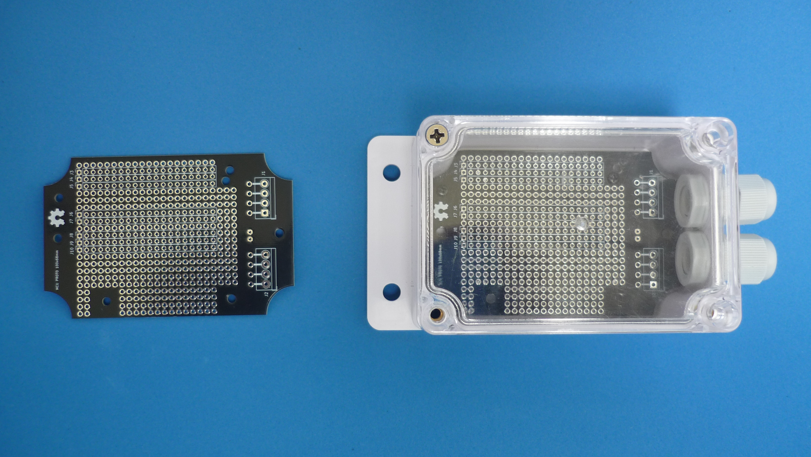
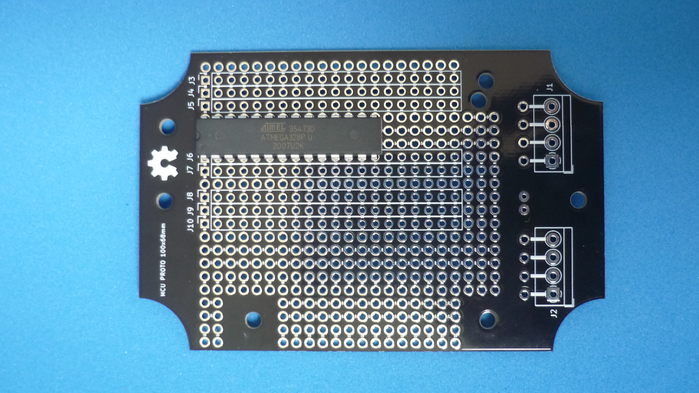
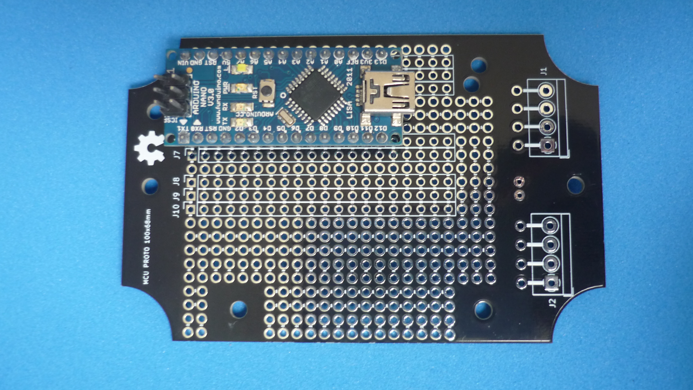
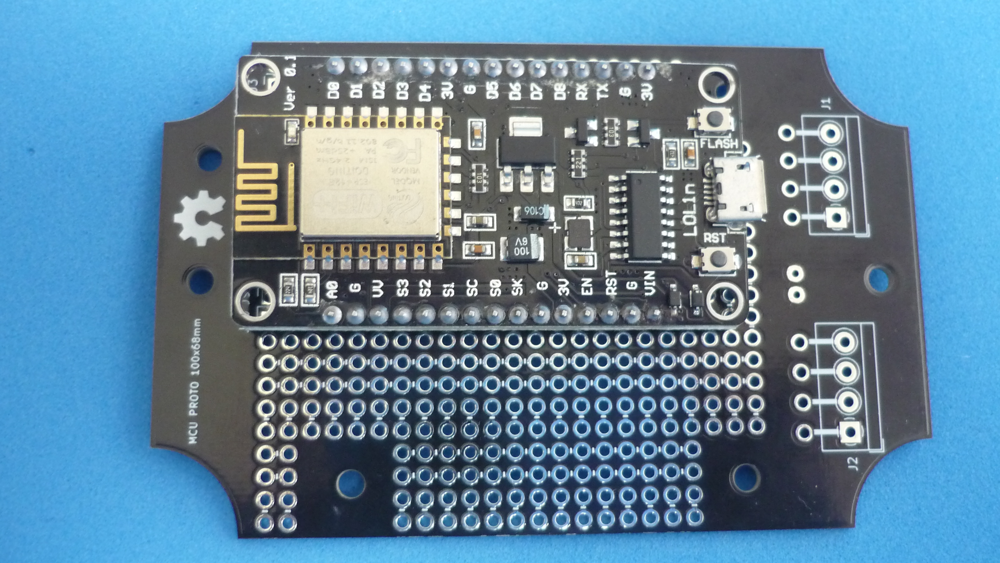
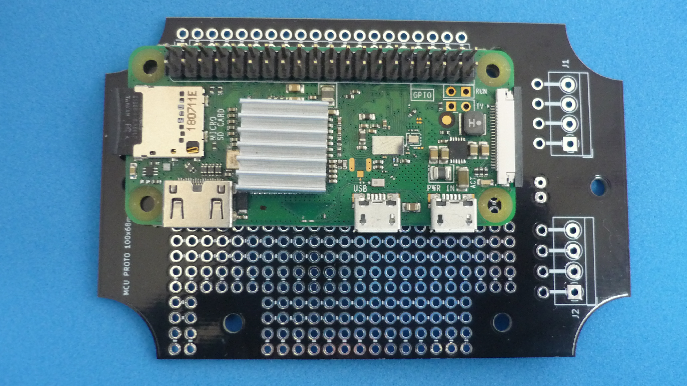
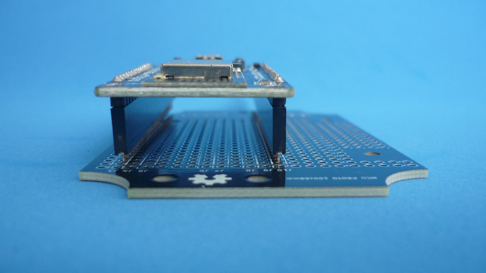

# PROTOTYPE BOARD FOR MCU MODULES AND FITS INSIDE 100x68mm WATERPROOF HOUSING

This board can host MCU modules up to 20 pin per row in a double row configuration. The minimum separation between rows is 2.54 mm and the maximum separation between rows is 27.94 mm, so most common types of MCU modules are supported. The board is designed to fit inside a generic 100x68mm (advertized as Sonoff switch)  waterproof enclosure. 

## How to use this repository

The PCB was developed in KiCad V5.1,

## Directory structure

* The root folder contains template KiCad files: project, schematic and PCB 
* /library folder contains additional symbols needed to edit printed schematic
* /modules folder contains additional footprints needed to edit printed circuit board
* /gerber folder contains ready to manufacture files.
* /assets folder contains support files for reade.md

## PCB layout

## DIP IC

Dual in-line package chip placed with 7.62 mm separation between pin rows

## SMALL MODULE

An example showing an Arduino nano with 15.24 mm separation between header rows

## BIG MODULE

An example showing a NODE MCU V3 with 27.94 mm separation between header rows.

## DOUBLE ROW HEADER MODULE

An example showing an RPI ZERO with 2x20 header 2.5mm between pins

## ADDITIONAL SPACE

Female headers used for easy reuse of the module, gives additional space for small components or modules.

